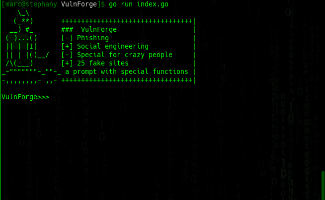
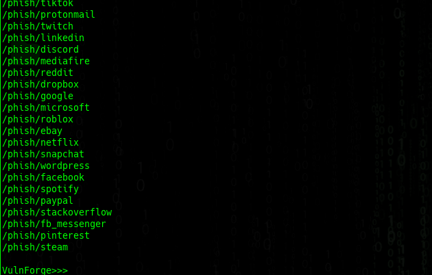
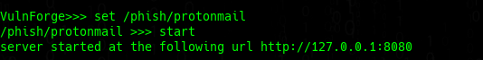
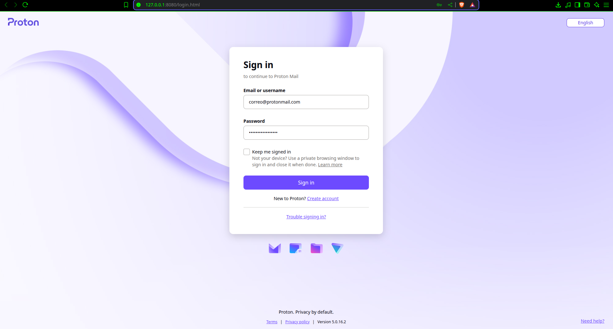
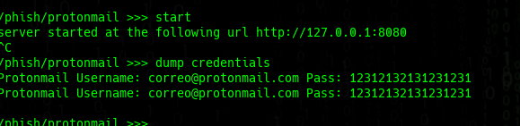
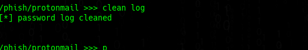

# VulnForge Beta Version
<center>
    <br>
</center>
* 

### A phishing tool programmed in Golang
#### For arch based distros and Debian distros
#### For Arch based distros
```
sudo pacman -Syu
sudo pacman -S go
```
#### For debian based distros
```
sudo apt -y update
sudo apt -y upgrade
sudo apt -y install go

```
### execute
```
go run index.go
```
### compile
```
go build index.go
```
#### how to use?

### Select from a wide variety of phishing templates
```
list phishing
```
<center>
    <br>
</center>

### Select and start http server
```
set /phish/protonmail
start
```
<center>
    <br>
</center>
<center>
    <br>
</center>

### Credentials you obtained
```
dump credentials
```
<center>
    <br>
</center>

### Clear password log
```
clean log
```

<center>
    <br>
</center>

## Authors
@DigitalNinja00
